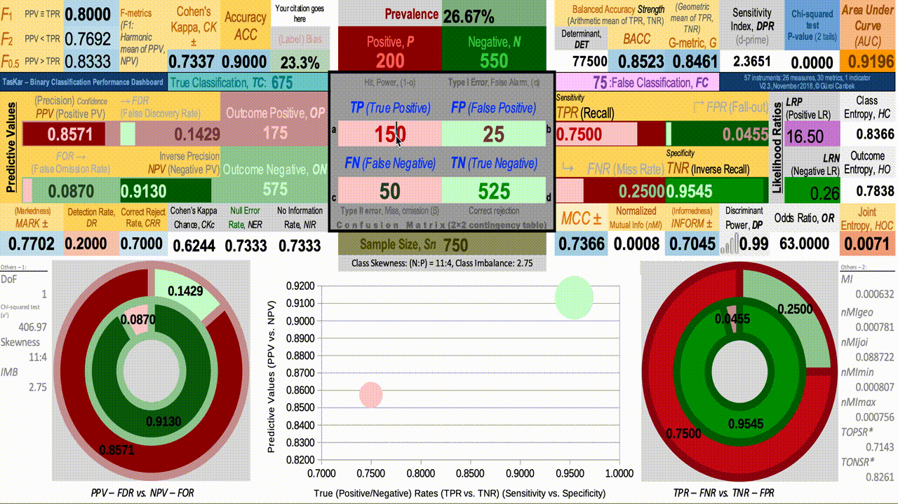

# TasKar, A Research Compedium of "New Means of Calculation and Representation of The Entire Binary-Classification Performance Instruments"
## Submitted to IEEE Computation Intelligence Magazine (CIM)
*  – Binary-Classification Performance Instruments Dashboard/Calculator/Visualizer*
* with novel  R Script to Reveal Confusion Matrix from a few metrics 

* Best viewed with [LibreOffice](https://www.libreoffice.org/download/libreoffice-fresh/).

Classification performance, which is very important in machine learning, states the success state of a classifier implementing a specific algorithm. Binary classifications or two-class classifications separate a given input into two opposite classes such as 'presence' vs. 'absence' of a disease (healthy) or a condition, 'spam' vs. 'non-spam' for an e-mail, and 'malign' vs. 'benign' software.

TasKar is a handy visually supported compact calculator to see the performance of a given binary classification by entering only the True Positives (***TP***), True Negatives (***TN***), False Positives (***FP***), and False Negatives (***FN***). It is based on an academical study given in the notes below.

Just input the four measures (***TP***, ***TN***, ***FP***, ***FN***) and TasKar calculates the entire performance measures and metrics.

TasKar calculates and shows 56 measures/metrics including True Positive Rate (*TPR*), Accuracy (*ACC*), Balanced Accuracy (*BACC*), *G*, *F1*, Normalized Mutual Information (*nMI*), Cohen's Kappa (*CK*), and Mathews Correlation Coefficient (*MCC*).

I hope that TasKar becomes a standard tool for calculating and expressing binary classification performances as well as using in machine learning education and trainings.

Please, contact and/or inform me for further usage on TasKar.

Gürol Canbek
October 13th, 2018

**NOTES**:
1) TasKar is prepared as a OpenDocument Spreadsheet file and tested with LibreOffice Calc (v2.3).
2) Please, cite our study if you use TasKar in your academic studies as
   Gürol Canbek, Seref Sagiroglu, and Tugba Taskaya Temizel, *New Means of Calculation and Representation of The Entire Binary-Classification Performance Instruments*, IEEE Computational Intelligence Magazine (CIM), (Submitted), November 2018, https://github.com/gurol/taskar
3) Please, check this repository for updates and the references.
4) See also: G. Canbek, S. Sagiroglu, T. T. Temizel, and N. Baykal, “Binary classification performance measures/metrics: A comprehensive visualized roadmap to gain new insights,” in *2017 International Conference on Computer Science and Engineering (UBMK)*, Antalya: IEEE, 2017, pp. 821–826. [Full Text](https://www.researchgate.net/publication/320829355_Binary_Classification_Performance_MeasuresMetrics_A_comprehensive_visualized_roadmap_to_gain_new_insights)
